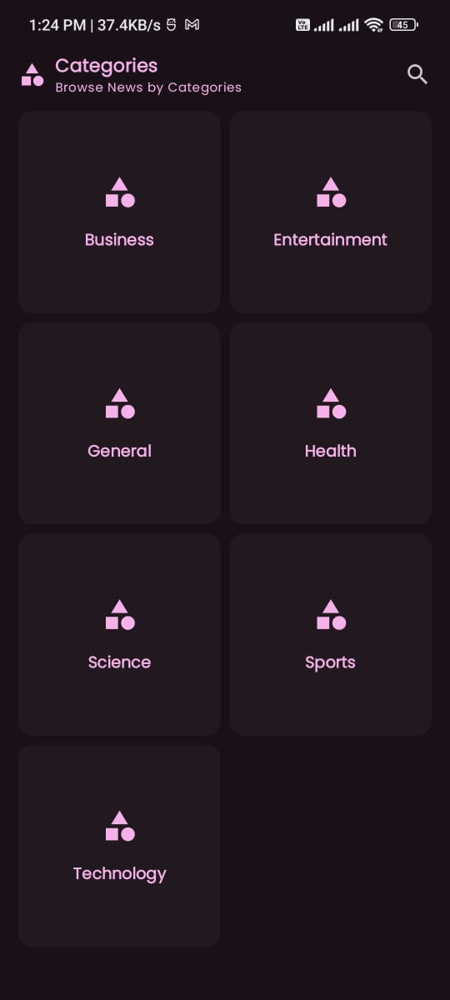
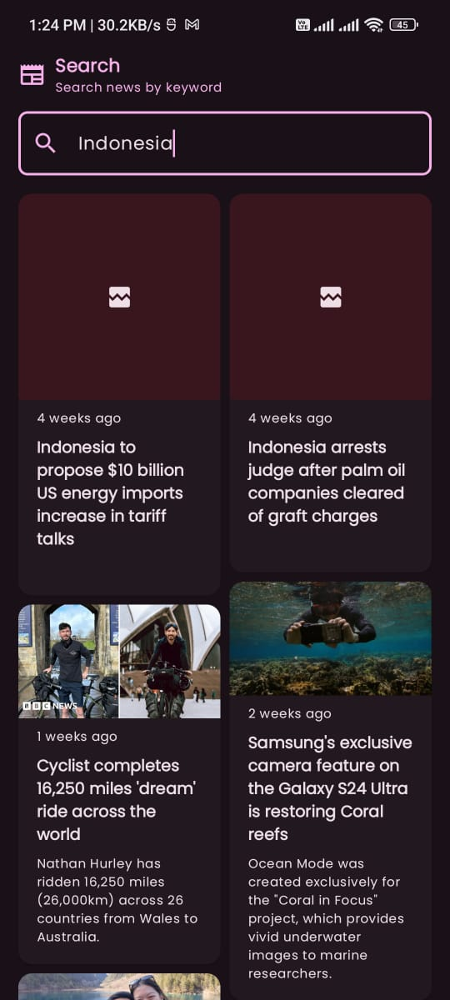

# Nyius
Nyius is News application.

## Prerequisite
Add API keys from https://newsapi.org/ to ``` DUMMY_API_KEY ``` variable in ``` com.mnhyim.data.remote.NewsApiImpl ```
## Requirements
- Show list of news categories
- Show lists of news sources by category
- Show articles by news source
- Open WebView of the article on click
- Search news articles
- Endless scrolling / pager
## Tech used
- **Kotlin**: Main programming language used
- **Compose**: Declarative UI framework
- **Koin**: Dependency Injection
- **Ktor**: HTTP client
- **Coil**: Image loader
- **Paging3**: Paging support for incremental loading of large lists
## Screenshot





## Things to improve
- Modularize ``` :features ``` module
- Reduce redundant code
## License
